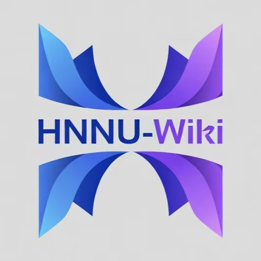

# HNNU-Wiki

**海南师范大学Wiki**
 

 

一个专为海南师范大学学生打造的Wiki

---

## 📖 关于手册

本手册第一版发布于 2024 年 10 月 22 日,至今仍在持续更新中。

我们深知一本手册无法帮助大家深入了解某一个领域的知识或掌握某项技能,但希望能为你的大学生涯提供一些方向和参考,帮助你找到属于自己的路。

目前手册的内容仅覆盖以下学院：

- 人工智能学院

## 🤝 贡献指南

欢迎所有同学为本手册贡献内容!

如果你想修改错别字、补充内容或添加新的章节,请参考[如何提交 PR](手册/如何提交PR.md)。

## 📝 免责声明

本手册内容仅供参考,具体信息请以学校官方通知为准。详见[免责声明](手册/免责声明.md)。

## 👥 贡献者

感谢所有为本项目贡献的同学!

