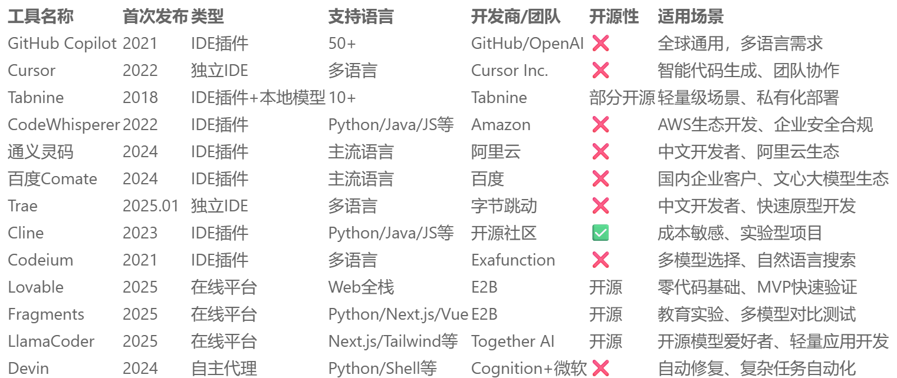
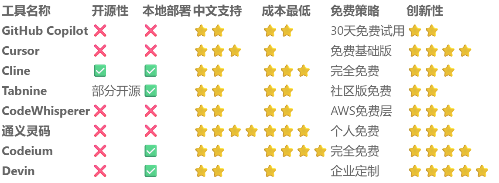

**AI 只是提高效率的工具，请勿过度依赖 AI，按需使用。**

# 2025年热门AI编程工具一览表

| 工具名称           | 核心特点                                                                 | 适用场景                          | 开发环境/访问方式                     | 定价模型              |
|--------------------|--------------------------------------------------------------------------|-----------------------------------|---------------------------------------|-----------------------|
| **GitHub Copilot** | 深度IDE集成、多语言支持（37+）、实时错误诊断                             | 通用编程辅助、快速原型开发、团队协作 | VS Code/JetBrains/Neovim插件          | 个人版 $10/月         |
| **Cursor**         | 双模型驱动（GPT-4 Turbo+Claude 3.7）、跨文件编辑、Composer模式批量重构   | 全栈开发、大型项目维护、AI结对编程  | 独立IDE（VS Code内核）                | Pro版 $20/月          |
| **通义灵码**       | 中文理解优化（92%准确率）、阿里云SDK深度集成、单元测试生成               | 国内企业项目、Java/Python开发      | VS Code/JetBrains插件、阿里云IDE      | **个人免费**          |
| **Windsurf**       | Claude Sonnet4集成、200K上下文窗口、级联重构（Cascade引擎）              | 复杂系统重构、多文件关联修改        | 独立IDE/VS Code兼容                   | Pro版 $15/月          |
| **JetBrains AI**   | 精准静态分析+AI补全、自然语言重构、测试生成                              | JetBrains生态用户、企业级开发       | IntelliJ/PyCharm等IDE内置             | 套餐制（含IDE订阅）    |
| **Bolt.new**       | 30秒极速建站、无本地环境需求、React/Vue深度支持                          | Web原型开发、教学演示、Hackathon   | 在线IDE（浏览器访问）                 | 免费版150K tokens/天  |
| **百度Comate**     | 中文语义强化、COBOL转Java等迁移优化、安全合规校验                        | 金融/政府项目、遗留系统现代化       | VS Code插件/百度智能云IDE             | 企业版￥199/月        |
| **Gemini CLI**     | 100万token上下文、谷歌搜索联动、多模态输出（代码+报告）                  | 研究型开发、跨领域探索              | 命令行工具（支持本地调用）            | **免费**（每日1000次）|

# 深度评测
[国内外主流AI编程工具全方位对比分析（截至2025年5月）](http://www.mzph.cn/diannao/82620.shtml)

