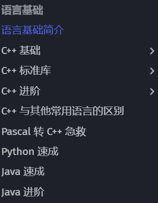
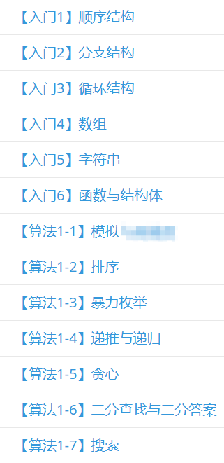

# 入门编程语言

由于培养方案的改变，现在大一新生首先接触的编程语言为 Python。但是笔者强烈建议掌握 C/C++，这样可以方便之后的各种学习，因此这篇文章仅提及 C/C++。

上图来源 [**OI-Wiki语言基础**](https://oi-wiki.org/lang/) ，从图中可以看出，使用 C++作为第一门学习的语言可以速成很多语言，甚至不学 C++需要急救。

# 对于零基础人群

* [菜鸟教程 C++ 教程](https://www.runoob.com/cplusplus/cpp-tutorial.html)
> 本教程是专门为初学者打造的，帮助他们理解与 C++ 编程语言相关的基础到高级的概念。

* [OI WiKi 语言基础](https://oi-wiki.org/lang/)
> 本章将会介绍编程相关的知识，包括 C++ 从入门到进阶教程和一些其它语言的简介。\
> 程序是算法与数据结构的载体，是解决 OI 问题的工具。\
> 在 OI 中，最常用的编程语言是 C++。\
> 学习编程是学习 OI 最基础的部分。

* [C++ 在线编辑器](https://www.runoob.com/try/runcode.php?filename=helloworld\&type=cpp)
> 一个在线的C++编辑器

* [Dev-C++：适合初学者的 IDE](https://sourceforge.net/projects/orwelldevcpp/)
> Dev C++ 是一款免费开源的 C/C++ IDE，内嵌 GCC 编译器（GCC 编译器的 Windows 移植版），是 NOI、NOIP 等比赛的指定工具。Dev C++ 的优点是体积小（只有几十兆）、安装卸载方便、学习成本低，缺点是调试功能弱。

# 对于有一定基础的人群

推荐以上图的顺序进行学习 [**洛谷题单广场**](https://www.luogu.com.cn/training/list) ，题单难度不小，但可以依照此学习顺序。