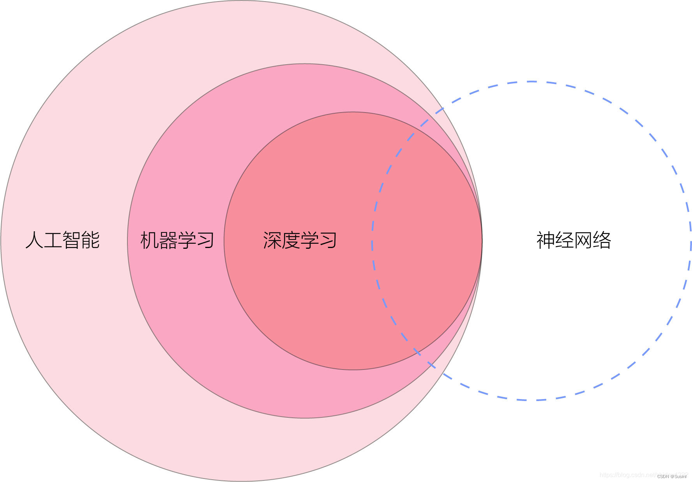

# 概念

## 人工智能（AI）

**定义**：人工智能是计算机科学的一个广泛领域，旨在创建能够执行通常需要人类智能的任务的系统。这些任务包括理解语言、识别图像、解决问题、进行决策等。

**特点**：

- AI 包括各种技术和方法，不限于机器学习。
- AI 的目标是使机器能够模仿人类的认知功能。

## 机器学习（ML）

**定义**：机器学习是人工智能的一个子领域，它专注于开发可以通过经验自动改进的算法和模型。机器学习的核心思想是让计算机从数据中学习，而无需明确编程。

**与 AI 的关系**：

- 机器学习是实现人工智能的一种方法。
- 通过机器学习，AI 系统可以根据数据进行学习和优化，从而提高性能。

**主要类型**：

- **监督学习**：使用带标签的数据进行训练。
- **无监督学习**：使用未标记的数据发现模式。
- **强化学习**：通过与环境的交互进行学习。

## 深度学习（DL）

**定义**：深度学习是机器学习的一个子领域，专注于使用多层神经网络（深度神经网络）来学习和表示数据。深度学习能够自动从原始数据中提取特征，特别适合处理复杂数据，如图像、音频和文本。

**与 ML 的关系**：

- 深度学习是机器学习的一种特定实现，强调使用深层结构来学习特征表示。
- 深度学习通过复杂的网络层级关系，能够捕捉数据中的复杂模式，比传统的机器学习方法更强大。

## 神经网络（NN）

**定义**：神经网络是深度学习的核心构建块，由大量相互连接的节点（神经元）组成，模拟人脑的神经元工作方式。神经网络通过输入数据的处理和层间的加权连接来学习特征。

**与 DL 的关系**：

- 神经网络是实现深度学习的基础模型。
- 深度学习通常指的是使用深层神经网络来处理数据，因此神经网络是深度学习的重要组成部分。

## 综合关系图示

## 总结

- **人工智能** 是一个广泛的领域，包含了所有使机器具有人类智能的技术。
- **机器学习** 是实现 AI 的一种方法，通过数据学习来优化性能。
- **深度学习** 是机器学习的一个子集，使用深层神经网络来学习复杂的数据特征。
- **神经网络** 是深度学习的基础模型，模仿人脑的结构来进行数据处理和学习。

# 如何入门

## 理论基础

### 1. 数学基础

AI 和机器学习（ML）有很多数学基础，以下是一些重要的数学领域：

- **线性代数**：矩阵运算、特征值和特征向量等。
- **概率与统计**：概率分布、期望、方差、假设检验等。
- **微积分**：函数的极值、梯度等，特别是在优化算法中很重要。

### 2. 计算机科学基础

- **编程语言**：Python 是最流行的 AI 编程语言，学习 Python 的基本语法和数据结构。
- **算法与数据结构**：了解基本算法和数据结构。

## 实践编程

### 1. 使用机器学习库

- **Scikit-learn**：适合初学者，提供了许多简单易用的机器学习算法。
- **TensorFlow** 和 **Keras**：用于构建和训练深度学习模型。
- **PyTorch**：灵活的深度学习框架，适合研究和开发。

### 2. 项目实践

- **Kaggle**：参加数据科学竞赛，处理真实世界的数据集，获得实践经验。
- **Github**：查找和贡献开源项目，学习他人的代码和项目结构。
- **个人项目**：选择感兴趣的主题（如图像识别、自然语言处理），构建自己的项目。

## 领域应用

- **计算机视觉**：学习图像处理和卷积神经网络（CNN）。
- **自然语言处理（NLP）**：学习文本处理和循环神经网络（RNN），以及现代的 Transformer 架构。
- **强化学习**：了解如何训练智能体在特定环境中决策。
