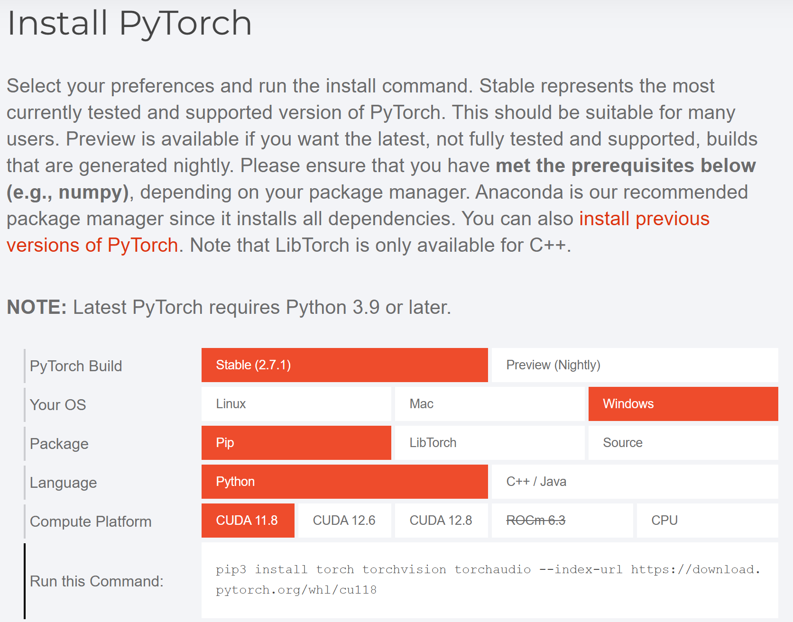

AI的环境搭建是一件稍有门槛的事情，这关系到操作系统、包、编程语言、CUDA版本等等，所以在安装之前请对包括但不限于 `Python，pip，CUDA，CUDNN` 的内容有一定的了解。同时也极力推荐大家使用虚拟环境安装

## PyTorch 的安装

请在 [PyTorch 官网](https://pytorch.org/) 中找到下表并选择自己的`操作系统、包、编程语言、CUDA版本`，随后运行给出的命令。

## TensorFlow 的安装
相较于 `PyTorch`，`TensorFlow` 的安装就复杂许多了，以下给出一些官方的网站、文档。

- [TensorFlow 官网](https://tensorflow.google.cn/?hl=zh-cn)

- [TensorFlow2 安装教程](https://tensorflow.google.cn/install?hl=zh-cn)

- [TensorFlow 教程](https://tensorflow.google.cn/tutorials?hl=zh-cn)

- [GPU支持](https://tensorflow.google.cn/install/gpu?hl=zh-cn)
