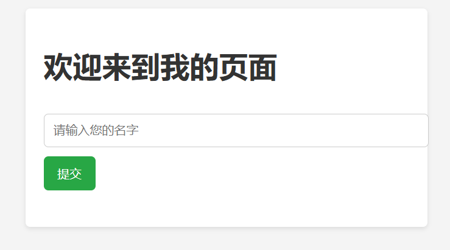
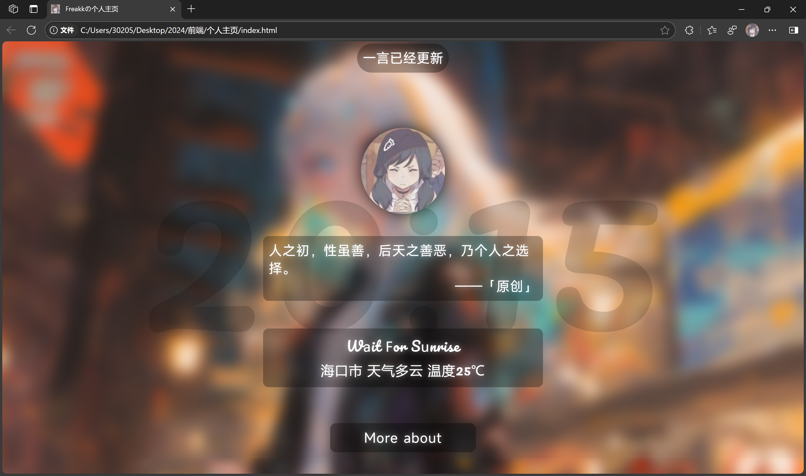
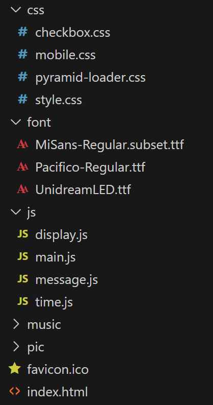

# 先导

前端最基本的三件套分别是 HTML、CSS、JavaScript。它们都是单独的语言，不过相互组合可以构成精美的界面。

* **HTML**：用于构建网页的骨架，包括结构、内容、样式等。
* **CSS**：用于美化网页的样式，包括字体、颜色、布局、动画等。
* **JavaScript**：用于实现网页的动态效果，包括动画、交互、数据处理等。

## 举个简单的例子

以下是一个简单的示例，展示了如何使用 HTML5、CSS 和 JavaScript 创建一个基本的网页。这个页面包含一个标题、一个文本输入框和一个按钮，用户可以输入名字并点击按钮，页面会显示一个欢迎信息。

### 示例代码
```
<!DOCTYPE html>
<html lang="zh">
<head>
    <meta charset="UTF-8">
    <meta name="viewport" content="width=device-width, initial-scale=1.0">
    <title>欢迎页面</title>
    <style>
        body {
            font-family: Arial, sans-serif;
            background-color: #f4f4f4;
            margin: 0;
            padding: 20px;
        }
        h1 {
            color: #333;
        }
        .container {
            background-color: white;
            padding: 20px;
            border-radius: 5px;
            box-shadow: 0 2px 5px rgba(0,0,0,0.1);
            max-width: 400px;
            margin: auto;
        }
        input[type="text"] {
            width: 100%;
            padding: 10px;
            margin: 10px 0;
            border: 1px solid #ccc;
            border-radius: 5px;
        }
        button {
            background-color: #28a745;
            color: white;
            border: none;
            padding: 10px 15px;
            border-radius: 5px;
            cursor: pointer;
        }
        button:hover {
            background-color: #218838;
        }
        .message {
            margin-top: 20px;
            font-size: 1.2em;
            color: #007bff;
        }
    </style>
</head>
<body>
    <div class="container">
        <h1>欢迎来到我的页面</h1>
        <input type="text" id="nameInput" placeholder="请输入您的名字">
        <button onclick="showWelcomeMessage()">提交</button>
        <div class="message" id="welcomeMessage"></div>
    </div>

    <script>
        function showWelcomeMessage() {
            const name = document.getElementById('nameInput').value;
            const messageDiv = document.getElementById('welcomeMessage');
            if (name) {
                messageDiv.innerHTML = `欢迎, ${name}!`;
            } else {
                messageDiv.innerHTML = '请输入一个名字。';
            }
        }
    </script>
</body>
</html>
```
### 展示



### 代码说明

1. **HTML（结构）**：
   * 使用`<h1>`标签显示标题。
   * 使用`<input>`标签创建一个文本输入框，让用户输入名字。
   * 使用`<button>`标签创建一个按钮，用户点击后触发JavaScript函数。
   * 使用一个`<div>`标签来显示欢迎信息。
2. **CSS（样式）**：
   * 设置了页面的背景色、字体和容器的样式。
   * 为按钮和输入框添加了样式，使其更美观。
3. **JavaScript（行为）**：
   * 定义了一个`showWelcomeMessage`函数，当按钮被点击时会执行。
   * 函数获取输入框中的值，并在页面上显示欢迎信息或提示用户输入名字。

### 运行代码

将上面的代码复制到一个`.html`文件中，然后用浏览器打开，就能看到这个简单的网页，并可以测试输入和按钮功能。

## 更复杂一点的

这里晒一个简单的个人主页，仅由 HTML、CSS、JavaScript 编写。



文件结构如下：



> 可以忽略 font,music,pic 文件夹和 favicon.ico 文件为了防止 API 调用过多这里就不给出具体代码了。

同时，在这里指路一个非常好看的个人主页 **[指路 => GitHub——blog-home](https://github.com/wuhobin/blog-home)**

