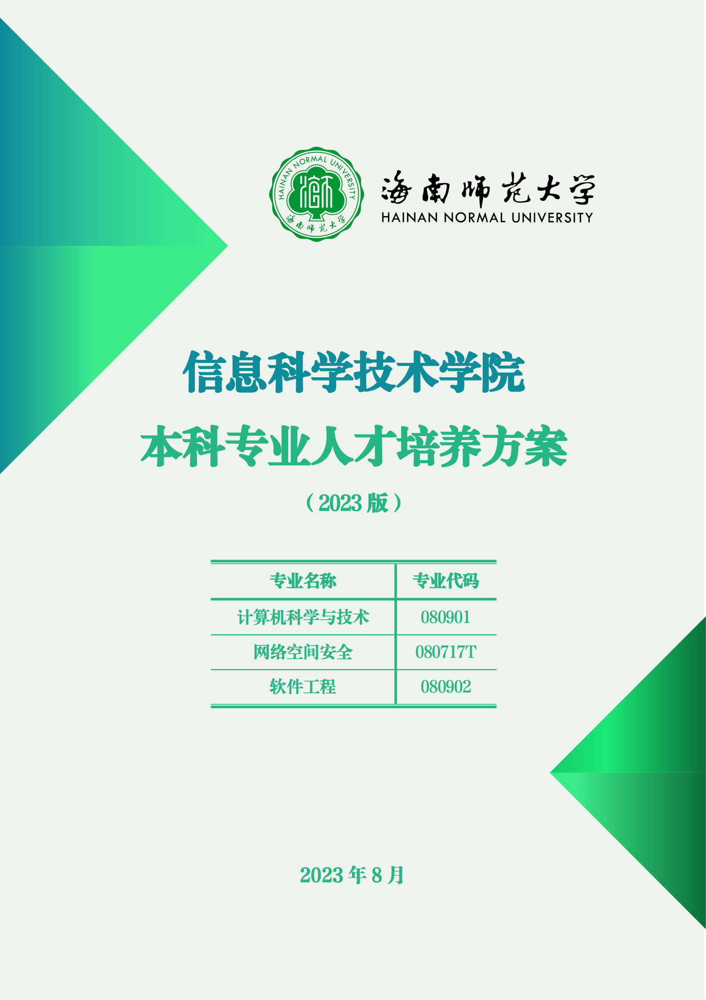
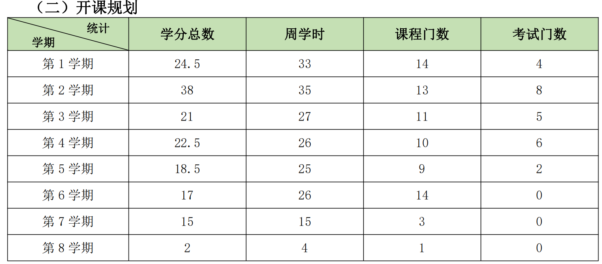
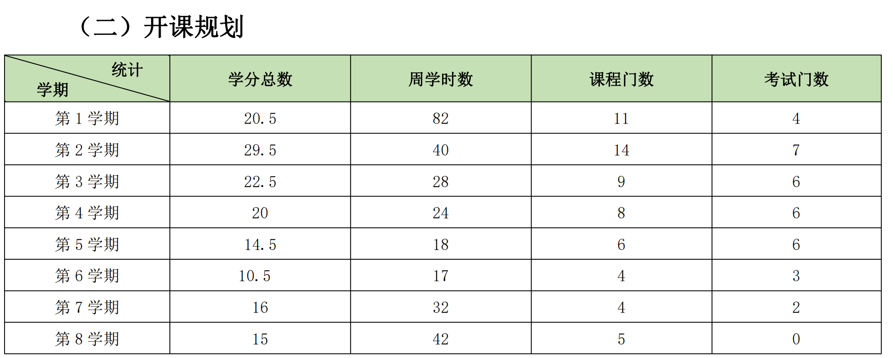
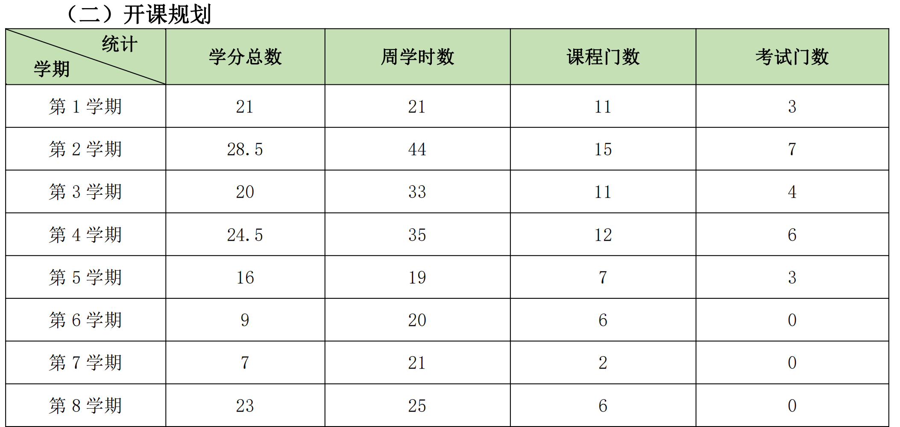

从 2023 级开始，信息院对原有培养方案进行了改革，此培养方案一直施行至今

# 课程统计表格

> 表格由 AI 提取而成，如若有误请联系我们

## 计算机科学与技术专业

| 学期     | 课程名称                                                                                    |
| ------ | --------------------------------------------------------------------------------------- |
| 第 1 学期 | 思想道德与法治、中国近现代史纲要、大学英语（一）、大学体育与健康（一）、计算机导论、大学生心理健康教育、高等数学 A（上）、军事理论、大学生安全教育、Python 语言程序设计          |
| 第 2 学期 | 马克思主义基本原理、毛泽东思想和中国特色社会主义理论体系概论、大学英语（二）、大学体育与健康（二）、程序设计基础、高等数学 A（下）、线性代数、离散数学I |
| 第 3 学期 | 习近平新时代中国特色社会主义思想概论、大学英语（三）、大学体育与健康（三）、概率统计 A、离散数学 II、数字逻辑与数字电路                          |
| 第 4 学期 | 大学英语（四）、大学体育与健康（四）、数据结构、计算机组成原理、计算机网络                                                   |
| 第 5 学期 | 操作系统、数据库原理及应用、软件工程、人工智能                                                                 |
| 第 6 学期 | 编译原理、信息技术课程与教学论、信息技术课程教材分析与教学设计、信息技术教学技能训练                                              |
| 第 7 学期 | 教育实践（见习、研习和实习）                                                                          |
| 第 8 学期 | 毕业论文                                                                                    |

## 网络空间安全专业

| 学期     | 课程名称                                                                                         |
| ------ | -------------------------------------------------------------------------------------------- |
| 第 1 学期 | 思想道德与法治、中国近现代史纲要、大学英语（一）、大学体育与健康（一）、高等数学 A（上）、计算机导论、大学生心理健康教育、军事理论、大学生安全教育、Python 语言程序设计、网络空间安全数学基础（1） |
| 第 2 学期 | 马克思主义基本原理、毛泽东思想和中国特色社会主义理论体系概论、大学英语（二）、大学体育与健康（二）、高等数学 A（下）、线性代数、学科专业导论            |
| 第 3 学期 | 习近平新时代中国特色社会主义思想概论、大学英语（三）、大学体育与健康（三）、概率统计 A、网络空间安全数学基础（2）、数字逻辑与数字电路、数据结构                    |
| 第 4 学期 | 大学英语（四）、大学体育与健康（四）、计算机组成原理、计算机网络安全、信息论与编码                                                    |
| 第 5 学期 | 操作系统、数据库原理与应用、密码学、网络安全法规                                                                     |
| 第 6 学期 | 编译原理、模式识别                                                                                    |
| 第 7 学期 | 专业实习                                                                                         |
| 第 8 学期 | 毕业论文                                                                                         |

## 软件工程专业

| 学期     | 课程名称                                                                                                |
| ------ | --------------------------------------------------------------------------------------------------- |
| 第 1 学期 | 思想道德与法治、中国近现代史纲要、大学英语（一）、大学体育与健康（一）、大学生心理健康教育、军事理论、高等数学A（上）、大学生安全教育、IT 专业英语1、Python 编程                       |
| 第 2 学期 | 马克思主义基本原理、毛泽东思想和中国特色社会主义理论体系概论、大学英语（二）、大学体育与健康（二）、程序设计基础、离散数学I、高等数学A（下）、线性代数、IT 专业英语2、Linux 应用基础 |
| 第 3 学期 | 习近平新时代中国特色社会主义思想概论、大学英语（三）、大学体育与健康（三）、概率统计 A、软件工程概论、离散数学 II、数字逻辑与数字电路、面向对象程序设计                |
| 第 4 学期 | 大学英语（四）、大学体育与健康（四）、数据结构、计算机组成原理、计算机网络、HTML5 编程、J2EE Web 应用程序设计/Django Web 应用程序设计                    |
| 第 5 学期 | 操作系统、数据库原理及应用、面向对象分析与建模技术、软件体系结构、移动应用开发技术、高性能 Web 应用构建技术/数据挖掘与数据分析                                  |
| 第 6 学期 | 软件设计模式、软件项目管理、人工智能导论、软件测试与质量保证、神经网络与深度学习/基于微服务架构应用开发                                                |
| 第 7 学期 | 专业综合实训、专业实习                                                                                         |
| 第 8 学期 | 毕业论文                                                                                                |

# 计科培养方案

# 网安培养方案

# 软工培养方案

